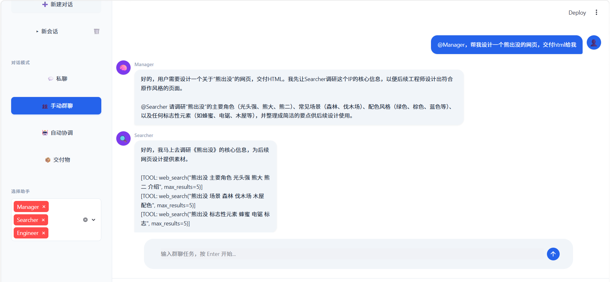
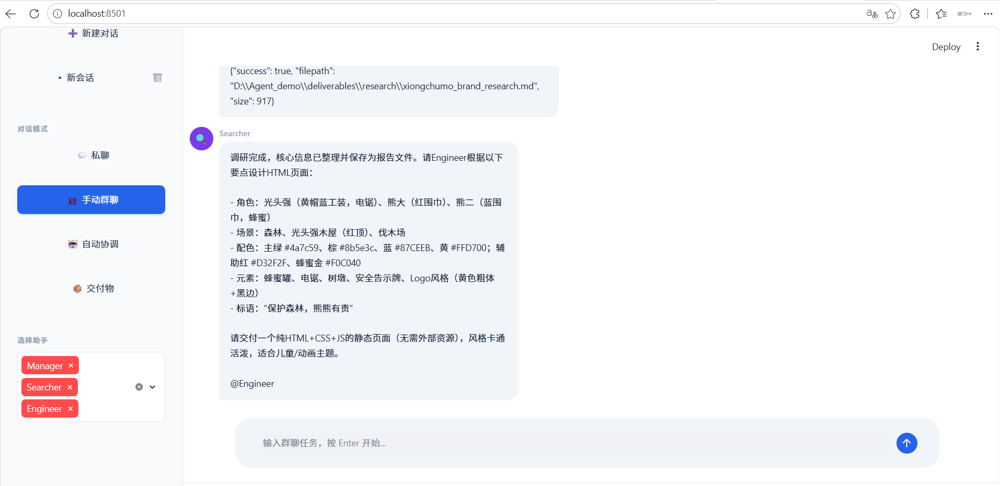
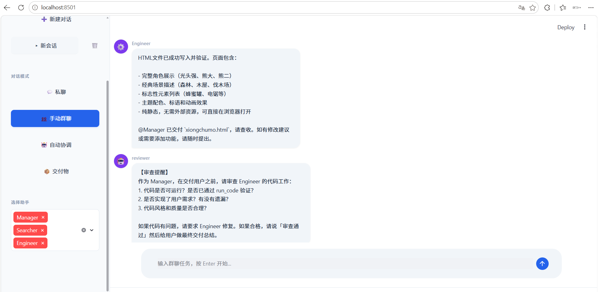
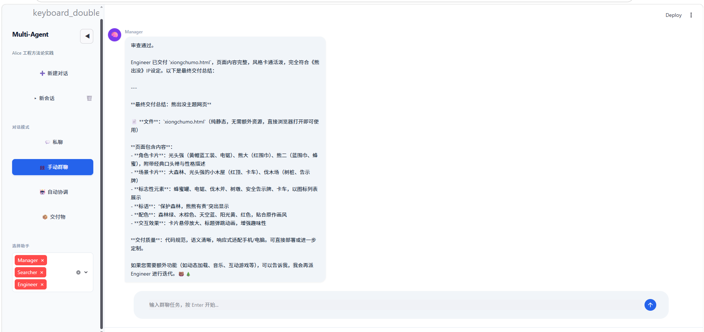
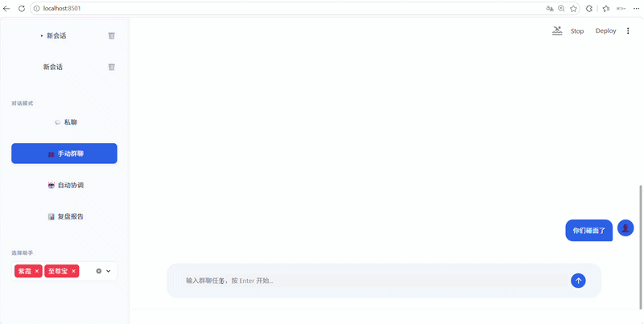

# Multi-Agent Collaboration Demo

基于 [AutoGen](https://github.com/microsoft/autogen) 的多智能体协作演示系统，参考《Alice 工程方法论》设计。

**核心亮点**：Agent 不是被动等待调用的工具，而是有角色、有记忆、能协作的团队成员。支持**工作协作**与**故事续写**两种模式。

---

## 项目缘起（碎碎念）

### 从 Hermes Agent 的伪工作流说起

做这个 demo 的起因，是我在使用 Hermes Agent 时发现了一个根本性问题：它无法真正联动多个 profiles。我尝试让它按照工作流规则一层层传递任务，下游的 profile 也可以向上游提问，做完一个项目后各自复盘、自我迭代、更新专属 skills。一开始看起来运行正常，直到我发现所有的 skills 都更新到了最上游的 profile 里。

问题的根源在于：它只是把别的 profiles 的 SOUL.md 作为 prompt 注入给了 subagent，并没有实现真正的通信。subagent 没有记忆，所以这一套工作流下来，是**伪工作流 + 伪迭代**。

我认为关键突破点在于：**实现多 profiles 的真正通信**。就像微信、QQ、飞书这样的通信软件，只不过从人和人聊天，变成了 Agent 和 Agent 对接。

### 设计哲学：通信 vs 成本

多 Agent 真正通信的好处很明显：每个 Agent 能真正参与到工作流中，同时做真正的自我迭代，效率会越来越高。但代价也很直接：**非常消耗 token**。

我不知道 subagent 的 token 消耗和我的方案哪个更高。但我认准了一件事：AI 泡沫与中国电力能力。我大胆猜测，未来 token 会变成白菜价的，能够负担得起这个构思。

### Alice 的启发

使用 Alice 的过程中，我发现她几乎实现了我大部分的构思，UI 设计也非常舒服。后来读了《Alice 工程方法论》（非常推荐：[https://alice.miyang.cn/methodology/](https://alice.miyang.cn/methodology/)），就尝试学习并做了这么一个 demo。为了快速落地，本项目是 vibe coding 的。

---

## 项目简介

这个 demo 原本只是想做工作流协作。但在搭建过程中发现一个有趣的事情：既然 Agent 之间可以像微信一样独立通信、有记忆、有性格，那能不能用来**做别的事情**？

比如那些让人意难平的故事。我们经常会想象，如果某个人物当时做了别的选择，结果会不会不一样。如果某些角色能够再见面，会聊些什么呢？于是我尝试给 Agent 注入第一人称记忆，让他们成为那些角色，然后互相聊天。

所以同一个架构里，并存了两种看起来完全不同的用法：

### 模式一：工作协作

模拟带 Coordinator 的多角色协作团队：

- **Manager**：Coordinator，理解需求、分析任务、自动协调分工
- **Searcher**：调研员，负责信息搜集、资料查询、事实核查（已绑定真实搜索工具）
- **Engineer**：开发者，负责代码实现、技术方案设计（已绑定代码执行工具）

### 模式二：故事续写

Agent 扮演经典角色，注入第一人称记忆，在 if 线中自由对话：

- **至尊宝** × **紫霞**：《大话西游》经典角色对话
- 可扩展：在 `memory/story_roles/` 下新增角色 JSON 即可

**三种交互模式**：

1. **私聊模式**：与任意 Agent 一对一对话，支持连续上下文
2. **手动群聊**：选择进群的 Agent，观察协作过程（或角色对话）
3. **自动协调**：Manager 自动分析任务、决定需要谁、拉群协作

---

## 功能特性

### 已实现

- [X] **多 Agent 私聊**：与 Manager/Searcher/Engineer 独立对话，支持连续上下文
- [X] **Coordinator 自动协调**：Manager 分析任务 → 自动决定分工 → 拉群协作
- [X] **`@` 机制调度**：Agent 通过 `@AgentName` 指定下一位发言人
- [X] **群聊流式展示**：Streamlit 前端实时逐句展示群聊过程
- [X] **会话级记忆持久化**：退出时保存对话历史，启动时自动恢复
- [X] **Agent 画像注入**：启动时加载 `memory/agents/{name}_profile.json`
- [X] **群聊自动复盘**：群聊 ≥3 轮后，Manager 自动生成团队评估报告
- [X] **自我进化**：复盘结果自动提取改进建议，更新各 Agent 画像
- [X] **用户画像记录**：自动记录用户的任务偏好和交互历史
- [X] **API 降级保护**：API 异常时返回友好提示，不崩溃
- [X] **工具绑定**：Searcher 集成 DuckDuckGo 搜索 + 网页抓取；Engineer 集成代码写入与执行
- [X] **审查闭环**：Agent 交接时互相审查，保证工作质量
- [X] **上下文压缩**：对话过长时 LLM 自动摘要，保留关键信息
- [X] **故事模式**：Agent 扮演影视角色，注入第一人称记忆，逐句对话
- [X] **交付物管理**：调研报告、代码文件、复盘报告统一在「交付物」页面查看

### 进阶方向

- [ ] 向量记忆：用向量数据库存储长期语义记忆
- [ ] 模型路由：不同任务自动切换不同模型（轻量/强力）
- [ ] WebSocket 推送：真正的实时消息推送，替代轮询

---

## 快速开始

### 1. 安装依赖

```bash
pip install -r requirements.txt
```

或手动安装：

```bash
pip install pyautogen ag2[openai] streamlit ddgs
```

### 2. 配置 API Key

本项目优先从**环境变量**读取 API Key，避免密钥硬编码在代码中。

**Windows（PowerShell）**

```cmd
$env:API_KEY = "sk-..."
$env:API_MODEL = "模型名"
$env:API_BASE_URL = "模型URL"
```

**macOS / Linux**

```bash
export API_KEY=sk-...
export API_MODEL=模型名称
export API_BASE_URL=模型URL
```

> 如果不设置环境变量，项目会回退到 `config/settings.py` 中的默认值（`sk-your-api-key-here`），运行时会报错提示你配置。

### 3. 运行项目

**Streamlit 可视化界面（推荐）**

```bash
streamlit run app.py
```

浏览器会自动打开 `http://localhost:8501`，支持工作协作和故事续写两种模式。

**命令行模式**

```bash
python main.py
```

纯终端交互，适合快速测试或不方便启动浏览器的环境。支持工作协作和故事角色群聊。

---

## 使用示例

### 示例 1：工作协作（自动协调）

> 因完整运行时间较长，以下用截图展示关键步骤。

**① Manager 分析任务并协调分工**



**② Searcher 调用工具进行调研**



**③ Engineer 编写并保存代码**



**④ Manager 总结交付，自动生成复盘报告**



### 示例 2：故事续写（群聊模式）



### 示例 3：私聊模式

选择任意 Agent（Manager / Searcher / Engineer / 至尊宝 / 紫霞），一对一连续对话。

---

## 项目结构

```
multi-agent-demo/
├── app.py                     # Streamlit 可视化前端（主入口）
├── main.py                    # 命令行交互入口
├── README.md                  # 本文件
├── .gitignore                 # Git 忽略规则
│
├── config/
│   ├── __init__.py
│   └── settings.py            # API Key、模型参数、LLM 配置
│
├── agents/
│   ├── __init__.py
│   ├── base_agent.py          # Agent 基类：画像加载/注入、记忆持久化
│   ├── manager.py             # Manager（Coordinator）
│   ├── searcher.py            # Searcher（调研员）
│   ├── engineer.py            # Engineer（开发者）
│   └── story_character.py     # 故事角色（轻量包装，无工作流污染）
│
├── core/
│   ├── __init__.py
│   ├── agent_factory.py       # 工厂：集中创建和管理 Agent 实例
│   ├── private_chat.py        # 私聊管理：一对一连续会话
│   ├── group_chat.py          # 群聊管理：@ 机制、流式推送、模式切换
│   ├── reviewer.py            # 审查闭环：Agent 交接时互相审查
│   └── context_compressor.py  # 上下文压缩：LLM 自动摘要
│
├── tools/
│   ├── __init__.py
│   ├── tool_registry.py       # 工具注册与拦截
│   ├── searcher_tools.py      # Searcher 工具：搜索、网页抓取、保存报告
│   └── engineer_tools.py      # Engineer 工具：写代码、执行代码
│
├── utils/
│   ├── __init__.py
│   └── chat_logger.py         # 日志工具：按日期归档聊天记录
│
├── memory/                    # 记忆持久化目录
│   ├── history/               # 对话历史缓存（启动时恢复）
│   ├── agents/                # Agent 画像（注入 system_message）
│   ├── story_roles/           # 故事角色配置（第一人称记忆）
│   ├── user/                  # 用户画像（偏好、交互历史）
│   ├── sessions/              # Streamlit 会话存档
│   └── projects/              # 群聊复盘报告
│
├── deliverables/              # 交付物目录
│   ├── code/                  # Engineer 输出的代码文件
│   └── research/              # Searcher 输出的调研报告
│
├── logs/                      # 运行日志
│
└── references/                # 附件/参考资料
    └── attachments/
```

---

## 核心机制说明

### `@` 机制调度

基于 AutoGen `GroupChat.speaker_selection_method` 自定义实现：

1. Agent 在 system_message 中被教导：分配/转交任务时必须写 `@AgentName`
2. `custom_speaker_selection()` 解析最后一条消息中的 `@AgentName`
3. 匹配到目标 Agent → 指定其为下一个发言人
4. **Story 模式兜底**：若角色忘记 @，自动轮询另一角色，保证对话不中断

### 记忆系统（两层半）

| 层级         | 内容                       | 持久化方式                            |
| ------------ | -------------------------- | ------------------------------------- |
| 对话历史缓存 | 最近 15 轮私聊 / 10 轮群聊 | `memory/history/{name}.json`        |
| Agent 画像   | 能力、沟通风格、自我反思   | `memory/agents/{name}_profile.json` |
| 故事角色     | 第一人称记忆、性格、遗憾   | `memory/story_roles/{name}.json`    |
| 用户画像     | 任务偏好、交互历史         | `memory/user/profile.json`          |
| 项目约定     | 复盘报告、任务摘要         | `memory/projects/`                  |

### 自我进化闭环

```
群聊结束
    ↓
Manager 生成复盘报告（自然语言）
    ↓
Manager 再输出结构化画像更新指令（JSON）
    ↓
解析 JSON → 写回各 Agent 的 self_reflections
    ↓
save_profile() → 持久化到 *_profile.json
    ↓
下次启动 → _load_profile() → 注入 system_message
    ↓
Agent 带着新经验开始工作
```

### 故事模式（Story Mode）

```
用户输入分歧点情境
    ↓
AgentFactory 加载 memory/story_roles/*.json
    ↓
编译为 system_message（世界观 + 第一人称记忆 + 性格 + 遗憾 + 说话风格约束）
    ↓
StoryCharacter（轻量类，不继承 BaseAgent）创建角色
    ↓
GroupChatSession(mode="story") 启动群聊
    ↓
跳过工具拦截、reviewer、上下文压缩，保持对话纯净
    ↓
逐句 yield → Streamlit 实时展示
```

---

## 按 Alice 工程方法论的对齐

本项目的设计和落地参考了《[Alice 工程方法论](https://alice.miyang.cn/methodology/)》。

| 章节     | 核心原则                                               | 落地情况                        |
| -------- | ------------------------------------------------------ | ------------------------------- |
| 第一章   | 关系型 AI：Agent 有独立人格和记忆                      | ✅ 工作角色 + 故事角色双重人格  |
| 第三章   | Agent Loop：事件流驱动                                 | ✅ 群聊基于事件循环，@ 机制调度 |
| 第五章   | 状态优先：记忆 > 上下文 > Prompt                       | ✅ 会话级 + 画像级 + 角色记忆   |
| 第六章   | Coordinator 模式：大任务分解 → 小任务执行 → 结果综合 | ✅ Manager 自动协调 + @ 机制    |
| 第十四章 | Prompt 工程：角色隔离 + 输出格式约束                   | ✅ @ 指引 + 语言禁令            |
| 第十五章 | 可丢弃组件：API 降级不崩溃                             | ✅ try/except 降级保护          |

---

## 技术栈

- **Python 3.10+**
- **AutoGen**（Microsoft）
- **Streamlit**（可视化前端）
- **ddgs**（DuckDuckGo Search，Searcher 搜索工具）

---

## 状态与致谢

**当前状态**：V1 版本，非常粗糙，还需要慢慢打磨。由于技术栈和时间都不够充裕，很多想法只实现了骨架，细节有待完善。

**特别感谢**：

- **Alice**（[alice.miyang.cn](https://alice.miyang.cn/)）：本项目的设计思路和交互范式深受 Alice 启发，几乎实现了我最初构思的大部分功能。
- **《Alice 工程方法论》**（[https://alice.miyang.cn/methodology/](https://alice.miyang.cn/methodology/)）：非常推荐阅读，对多 Agent 系统的设计有体系化的指导。

---

## License

MIT
